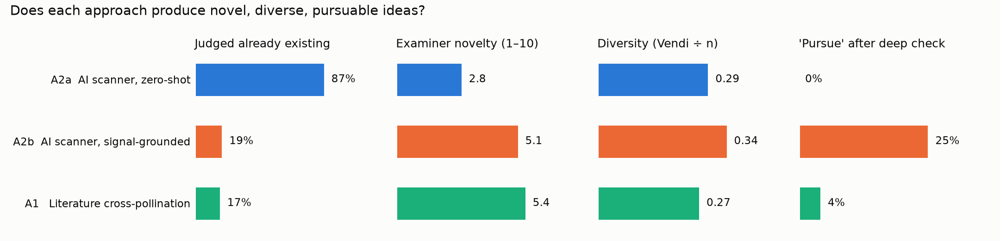
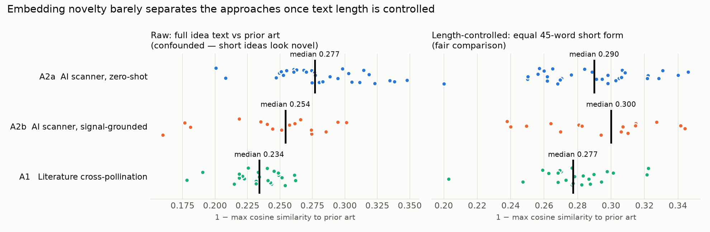

# Does an "AI Opportunity Scanner" actually work for novel concepts?

This answers the brief's question for Approach 2 ("AI Opportunity Scanner for Novel Ideas — analyse if this really works for novel concepts") with a controlled experiment rather than an opinion.

## The experiment
Three idea sources went through **the same filtration and novelty-detection engine**:

| Arm | What it is | How ideas were produced | n |
|---|---|---|---|
| **A2a** | AI Opportunity Scanner, **zero-shot** | The LLM was asked directly for novel, patentable banking ideas **before any data was gathered**. The file was SHA-256 hashed at creation (`ideas/A2a_zero_shot_scanner.sha256`), so it could not be revised after seeing data. | 30 |
| **A2b** | AI Opportunity Scanner, **signal-grounded** | 815 demand signals (Federal Register rules, central-bank and industry news, Hacker News) plus 127 CFPB complaint-issue trends, clustered into 30 themes and scored for pain × regulatory pull × momentum × tech push × patent whitespace. The LLM invented against the top 12 themes. | 16 |
| **A1** | Literature cross-pollination (Approach 1) | 60 bisociation pairs, each a novel finance problem × a novel mechanism from an unrelated field, chosen from 3,705 new items. | 23 |

Filtration was identical for all arms:
1. Automatic prior art: 4,770 patents (USPTO full text plus Google Patents) and 3,957 papers in the KB, a live USPTO relevance search on each idea's distinctive terms (plus the abstract and claim 1 of the top 12 hits), and live arXiv/Semantic Scholar searches.
2. Examiner-persona judgement against the closest prior art, on seven 1–10 criteria plus a verdict.
3. **Stage-2 deep check** of every idea ranked "pursue", and of the strongest "refine" ideas: targeted USPTO Boolean (BRS) queries plus web search of academic papers, products, standards drafts and regulator proposals.

## Results

| Metric | A2a zero-shot scanner | A2b grounded scanner | A1 cross-pollination |
|---|---|---|---|
| Judged **already existing** (drop-anticipated) | **87%** (26/30) | 19% (3/16) | 17% (4/23) |
| Examiner novelty, mean (1–10) | **2.8** | 5.1 | **5.4** |
| Non-obviousness, mean | 2.7 | 4.9 | 5.2 |
| Utility, mean | 6.2 | **7.3** | 6.5 |
| Commercial value, mean | 5.3 | **6.6** | 5.8 |
| Patent-eligibility, mean | 4.8 | 6.1 | 6.1 |
| "Crazy" (surprising yet credible), mean | 2.9 | 5.0 | **6.3** |
| "Pursue" after stage 1 → after deep check | 0 → **0** | 3 → **4** | 5 → **1** |
| Diversity (Vendi ÷ n, length-controlled) | 0.29 | **0.34** | 0.27 |
| Median description length (words) | 26 | 177 | 204 |

## What the evidence says

### 1. A zero-shot AI scanner does *not* produce novel concepts. It produces the consensus.
26 of 30 zero-shot ideas already exist as patents, shipping products, open standards or **regulator proposals**. Examples:
- A2a-01 (coercion-aware friction with a trusted contact) is covered by BioCatch's vishing-detection patent family and by RBI's April 2026 proposal requiring trusted-person approval for seniors' high-value payments.
- A2a-19 (dispute escrow window for instant payments) is covered by RBI's proposed cancellable 1-hour delay for transfers above ₹10k.
- A2a-02 (bounded-intent mandates for AI agents) is what AP2 intent/cart mandates and Mastercard Agentic Tokens already do.
- A2a-07 (ultrasonic liveness for voice calls) matches Pindrop's EP4706037A2 "Active voice liveness detection".

The ideas were *useful* (utility 6.2) and *feasible* (7.3, the highest), which is exactly why they already exist. This matches the literature. LLMs lack diversity in generation (Si et al. 2024), and GenAI pulls output toward shared modes (Doshi & Hauser 2024). Every team that asks a chatbot for "novel fintech patent ideas" gets roughly this list.

### 2. Automatic embedding novelty would have said the opposite, and been wrong.
On raw embedding distance the zero-shot arm looked the *most* novel (median 0.277 vs 0.254 / 0.234). The cause is a **length confound**: A2a ideas average 26 words and the others 180–200, and short text is less similar to everything. With an equal 45-word short form for every idea, the arms are nearly indistinguishable (0.290 / 0.300 / 0.277). **A similarity score cannot tell "well-known concept phrased briefly" from "new concept".** Vector-similarity thresholding (brief step 2) is fine for *filtering incoming papers*, but must not be the novelty verdict on *generated ideas*.

### 3. A grounded scanner *does* work, but because of the grounding and the filter, not the "AI".
A2b produced the highest share of ideas that survived the deep check (4 of 16), the highest utility and commercial scores, and the most diverse set. It worked because the demand signals point at **specific, current, under-researched pains**: 238k "investigation took more than 30 days" credit-report complaints, the €95M Italian voice-clone case, the September 2026 GENIUS Act proposals, and banks warning about AI shopping bots. Academics have not yet written about these, and incumbents' recent filings (see `COMPETITOR_WATCH.md`) do not cover them.

### 4. Cross-pollination gives the craziest ideas, and the ideas most likely to already exist in academia.
A1 scored highest on novelty and "crazy" at stage 1 (5 pursue). The stage-2 deep check then removed **4 of those 5**, and every one of them fell to *academic* prior art:

| A1 idea | Looked novel because… | Killed by |
|---|---|---|
| ENF grid-hum liveness for voice instructions | No patent found | **DeFakePro (2022)**: real-time ENF deepfake detection for live calls |
| Living QR (flicker-coded, event sensor) | Visa trusted-QR lacks liveness | **ScreenID (MobiCom'20)**: screen PWM fingerprint to detect reproduced QR codes |
| Latent-space equalisation bridge | No fraud-sharing patent found | **Secure Linear Alignment of LLMs (2026)**: cross-silo affine alignment |
| Scam-script phylogenetics with variant prediction | No banking art found | **Learned malware-evolution prediction of future variants (2025)** plus HRL/Triad phylogeny patents |

This is the **Gupta & Pruthi (2025)** effect observed first-hand: LLM ideas that feel novel often re-derive published work. The mechanism pool comes *from the literature*, and academics also move mechanisms across fields, so literature-sourced bisociations collide with literature. The one A1 survivor, **reachability-certified pre-emptive holds**, is anchored in a *specific operational problem* (India's 1930 golden hour) rather than in the mechanism alone.

### 5. The value sits in the filter, not the generator.
Generating 69 ideas took minutes. The **automatic** prior-art search caught obvious overlaps. The **deep check** (targeted Boolean patent queries plus web search of papers, products and standards drafts such as the IETF "Attenuating Agent Tokens" draft that anticipated A2b-12) changed 8 verdicts. Without stage 2 the pipeline would have recommended five ideas for filing that are not novel.

## Verdict on Approach 2
- **"AI Opportunity Scanner" as a chatbot asked for novel ideas: does not work** for patentable novelty (0 of 30 survivors, 87% already existing). It is still useful as a *coverage checklist* of the obvious.
- **AI Opportunity Scanner as a signal-grounded pipeline plus mandatory two-stage prior-art filter: works**, and on this run it was the best of the three arms for *surviving, commercially useful* inventions.
- **Recommended design (now the daily pipeline default):** use **A2b to choose the problem** (demand × whitespace), use **A1's mechanism pool to propose solutions to those problems**, and require **stage-2 deep prior-art checks** before anything is called novel.

## Honest limitations
- **Single run, n = 69.** The differences are directional, not statistically established.
- **The same model generated and judged** in queue mode. LLM self-evaluation is unreliable (Si et al. 2024), which is why automatic similarity is reported alongside and every surviving idea's prior art was checked by targeted search. Expert human review of the top dossiers is the next step.
- **A1 and A2b were generated by an operator who knew the A2a list**, since A2a was generated first by design. This can only have *reduced* overlap between arms. It does not help A1 or A2b beat prior art.
- **The deep check targeted top-ranked ideas.** A2a ideas mostly failed at stage 1, so they got no stage-2 check. The A2a anticipation rate (87%) comes from stage-1 evidence plus domain knowledge of products and regulations cited in each rationale (`runs/2026-09-30/operator_judge.py`).
- **Coverage gaps:** Google Patents throttled after about 1,100 global documents, so non-US families (CN, KR, JP, IN) are under-represented. Espacenet and InPASS checks are recommended before filing.
